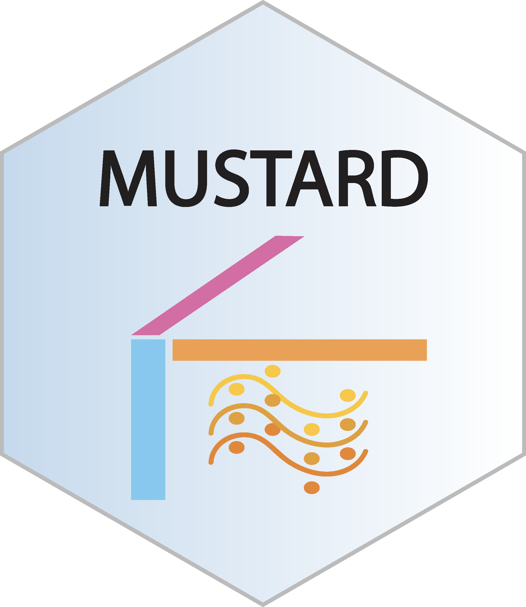

# MUSTARD 

The R package **MUSTARD** (**MU**lti-**S**ample **T**rajectory-**A**ssisted **R**eduction of **D**imensions) implements a trajectory-guided dimensionality reduction method for multi-sample scRNA-seq data. This all-in-one decomposition reveals major gene expression variation patterns along the trajectory and across multiple samples simultaneously, providing opportunities to discover sample endotypes and associated genes.

## Installation

To install the latest version of the R package from GitHub, please run following commands in R:

```         
if (!require("devtools"))
install.packages("devtools")
devtools::install_github("haotian-zhuang/MUSTARD")
```

## Vignettes
Detailed vignettes are available at this [website](https://haotian-zhuang.github.io/MUSTARD/).

## Citation

Please cite the following paper: [Zhuang, Haotian, Xin Gai, Anru R. Zhang, Wenpin Hou, Zhicheng Ji, and Pixu Shi. "Trajectory-guided dimensionality reduction for multi-sample single-cell RNA-seq data reveals biologically relevant sample-level heterogeneity." bioRxiv (2024): 2024-09.](https://www.biorxiv.org/content/10.1101/2024.09.14.613024v1)

## Contact

Authors: Haotian Zhuang, Pixu Shi

Report bugs and provide suggestions by sending email to:

Maintainer: Haotian Zhuang (haotian.zhuang@duke.edu)

Or open a new issue on this GitHub page
